# CLI Architecture

This document describes the Happy CLI (`packages/happy-cli`) and its daemon. The CLI is both an interactive tool and a background session manager that keeps machine state in sync with the server.

## System overview

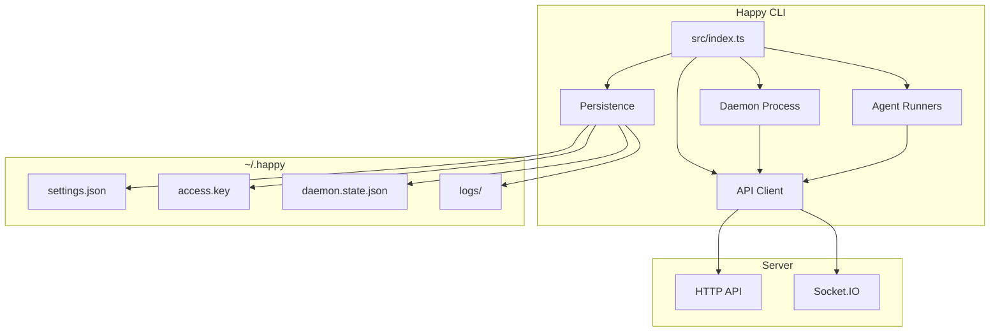

## High-level layout
- **Entry point:** `src/index.ts` parses subcommands and routes execution.
- **API client:** `src/api` handles HTTP + Socket.IO, encryption, and RPC.
- **Daemon:** `src/daemon` runs in the background, spawns sessions, and maintains machine state.
- **Persistence/config:** `src/persistence.ts` + `src/configuration.ts` manage local state in `~/.happy`.
- **Agents:** `src/claude`, `src/codex`, `src/gemini` provide provider-specific runners.
- **Shared daemon lifecycle:** `src/utils/daemonLifecycle.ts` provides `ensureDaemonRunning()` and default-agent resolution used by all agent entry paths.

## CLI entry flow

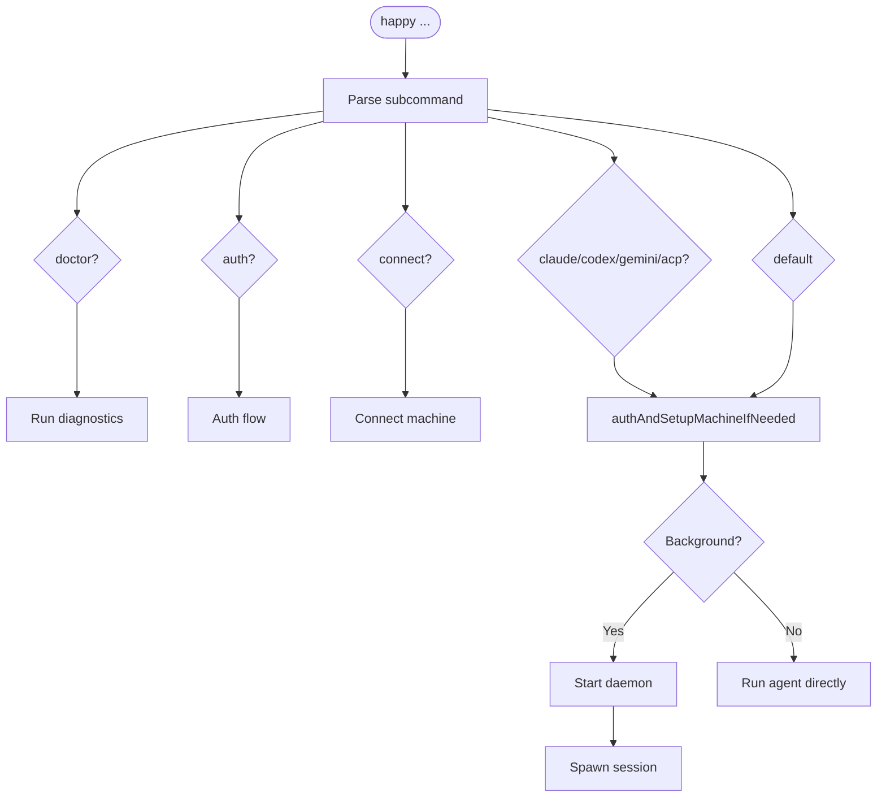

`src/index.ts` is the CLI router. It:
- Parses subcommands (`doctor`, `auth`, `connect`, `codex`, `gemini`, and default run flows).
- Ensures auth and machine setup when needed (`authAndSetupMachineIfNeeded`).
- Uses `ensureDaemonRunning()` for all agent flows (`claude`, `codex`, `gemini`, `acp`).
- Routes bare `happy` to the configured `defaultAgent` from settings (`claude` by default for backward compatibility).

## Local state and configuration

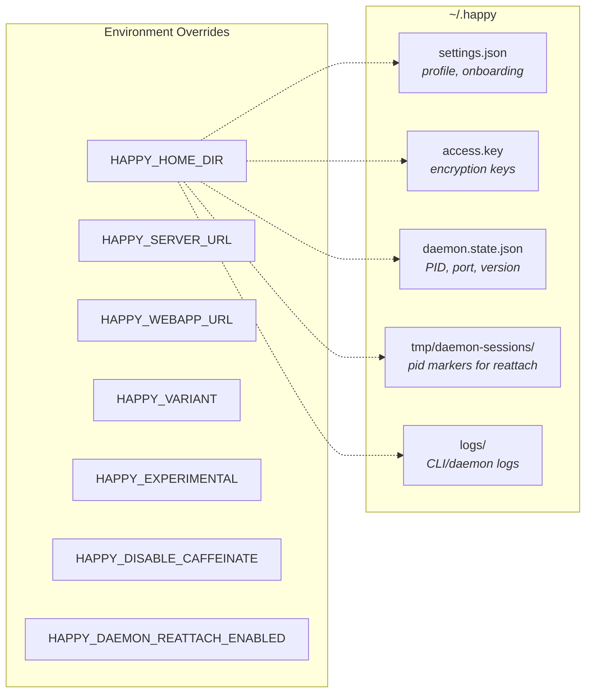

Local state lives under `~/.happy` (or `HAPPY_HOME_DIR`):
- `settings.json`: onboarding and profile settings (validated/migrated).
  - Includes CLI-only defaults such as `defaultAgent`.
- `access.key`: local key material for encryption/auth.
- `daemon.state.json`: daemon PID + control port + version.
- `tmp/daemon-sessions/pid-<pid>.json`: marker files used for known-session reattach after daemon restarts.
- `logs/`: CLI/daemon logs.

Configuration lives in `src/configuration.ts`:
- `HAPPY_SERVER_URL` and `HAPPY_WEBAPP_URL` override defaults.
- `HAPPY_VARIANT`, `HAPPY_EXPERIMENTAL`, `HAPPY_DISABLE_CAFFEINATE` control behavior.
- `HAPPY_DAEMON_REATTACH_ENABLED=0` disables startup reattach from marker files.

## API client architecture

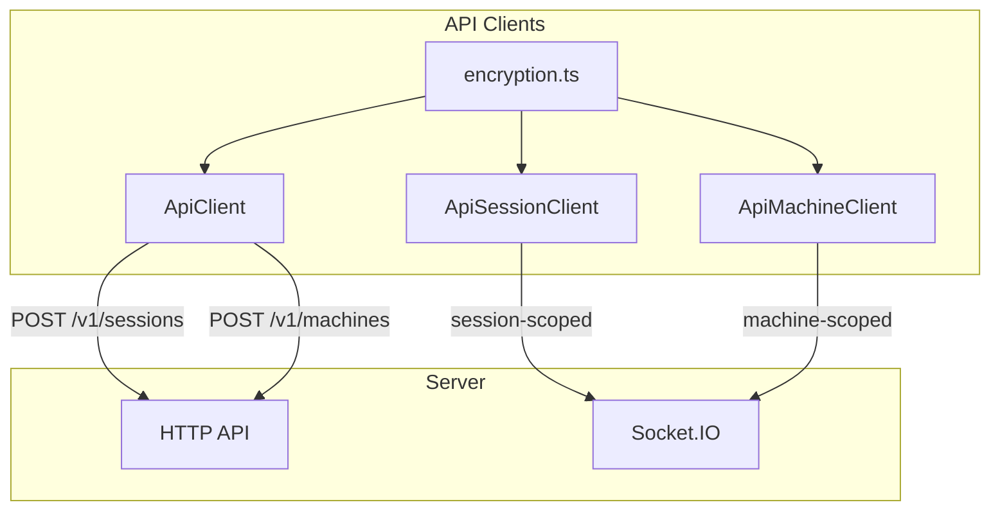

### HTTP
`ApiClient` (`src/api/api.ts`) handles:
- Session creation (`POST /v1/sessions`) with encrypted metadata/state.
- Machine registration (`POST /v1/machines`) with encrypted metadata/daemon state.
- Other CRUD actions through `ApiSessionClient` and `ApiMachineClient`.

### WebSocket

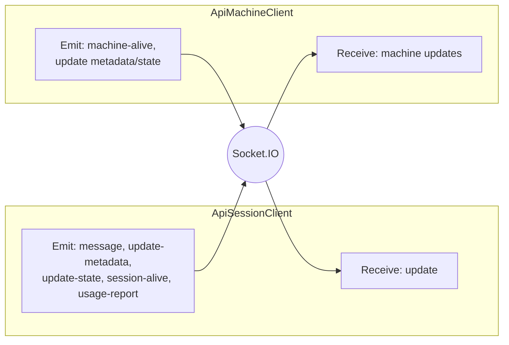

`ApiSessionClient` (`src/api/apiSession.ts`) connects to Socket.IO as a **session-scoped** client:
- Receives `update` events and decrypts message content.
- Emits `message`, `update-metadata`, `update-state`, `session-alive`, and `usage-report`.

`ApiMachineClient` (`src/api/apiMachine.ts`) connects as a **machine-scoped** client:
- Sends `machine-alive` heartbeats.
- Updates machine metadata/daemon state with optimistic concurrency.
- Receives machine updates and merges them locally.

### Encryption

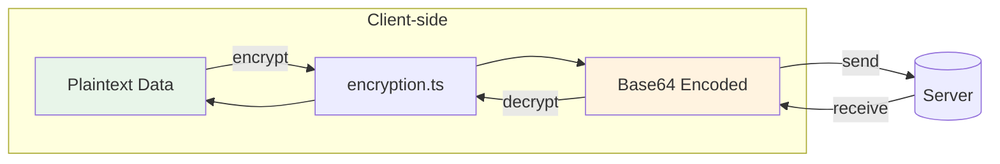

The CLI encrypts client content before it leaves the machine using `src/api/encryption.ts`.
- Session metadata, agent state, messages, machine state, artifacts, and KV values are encrypted client-side.
- On-wire encoding is base64; see `encryption.md`.

## Daemon architecture

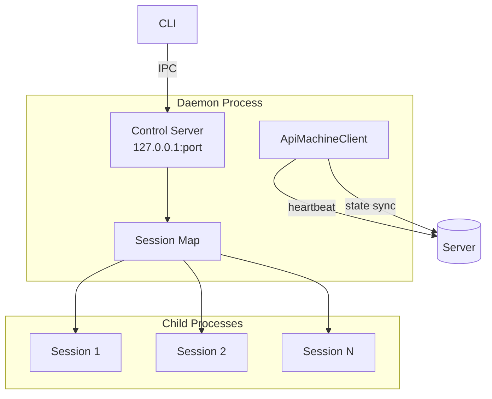

The daemon is a long-lived process responsible for running sessions in the background and maintaining machine presence.

### Known session reattach and PID safety

On startup, daemon can reattach to previously known sessions without server schema changes:

1. Session webhook writes local marker: `~/.happy/tmp/daemon-sessions/pid-<pid>.json`.
2. Marker stores `pid`, `sessionId`, `startedBy`, metadata snapshot, and `processCommandHash`.
3. On daemon restart, markers are filtered by:
   - current `HAPPY_HOME_DIR`,
   - alive PID,
   - allowed Happy process class (`doctor.ts` classification),
   - matching command hash (fail-closed).
4. `stop-session` uses PID safety check before SIGTERM for externally started/reattached sessions.

This minimizes false positives in PID-reuse scenarios. Use `HAPPY_DAEMON_REATTACH_ENABLED=0` to disable reattach.

### Lifecycle

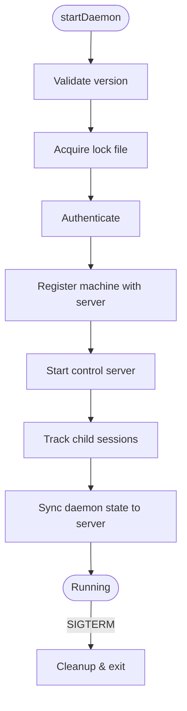

1. `startDaemon()` validates the running version and acquires a lock file.
2. It authenticates and registers the machine with the server.
3. It starts a local **control server** for IPC.
4. It keeps a map of tracked child sessions and updates daemon state on the server.

### Control server (local IPC)

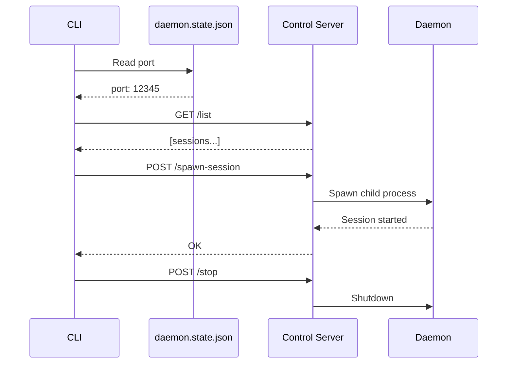

`startDaemonControlServer()` (`src/daemon/controlServer.ts`) runs an HTTP server on `127.0.0.1` and exposes:
- `/list` (list active sessions)
- `/stop-session`
- `/spawn-session`
- `/stop` (shutdown daemon)
- `/session-started` (session self-report)

The CLI talks to this server via `controlClient.ts`, using a port stored in `daemon.state.json`.

### Session spawning

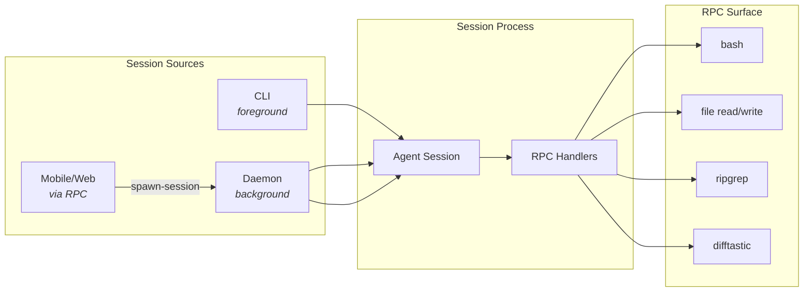

Sessions can be started by:
- The CLI directly (foreground).
- The daemon (background).
- Remote requests over RPC (from mobile/web via machine connection).

Daemon session spawning uses `registerCommonHandlers` to expose a controlled RPC surface (shell commands, file operations, search/diff helpers).

### Machine state

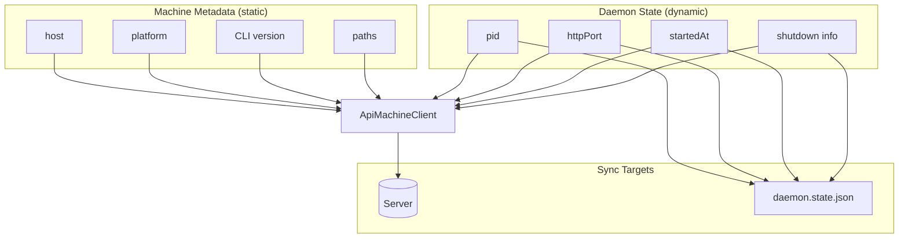

- **Machine metadata** is static info (host, platform, CLI version, paths).
- **Daemon state** is dynamic (pid, httpPort, startedAt, shutdown info).

The daemon updates these via `ApiMachineClient` and mirrors local state into `daemon.state.json` for control/diagnostics.

## RPC and tool bridge

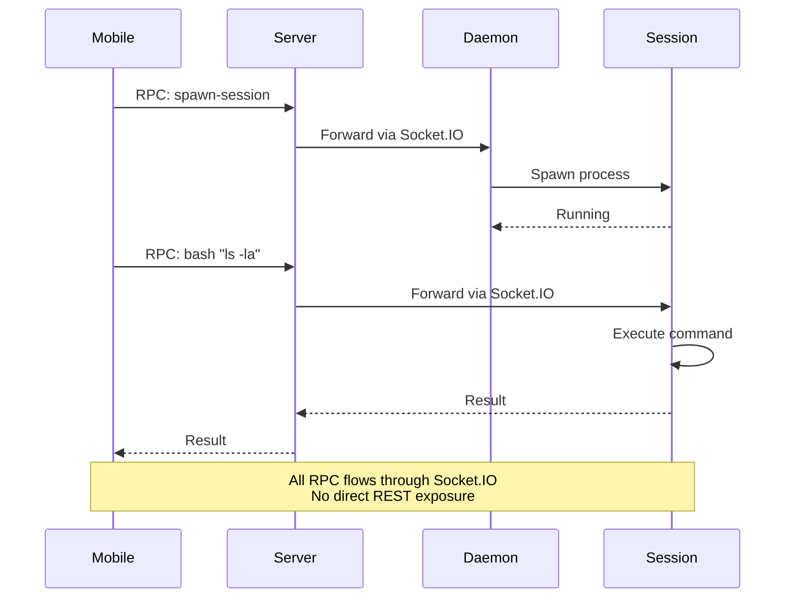

RPC is used to send commands over the Socket.IO connection:
- Sessions register RPC handlers (e.g., `bash`, file read/write, `ripgrep`, `difftastic`).
- Common machine/session handlers include `detect-cli` (PATH/PATHEXT scan) for cross-platform CLI detection.
- The daemon registers a spawn-session handler so the server/mobile client can ask it to start a local session.

This mechanism allows the server and mobile clients to drive local actions without exposing a broad REST surface.

## Implementation references
- CLI entry: `packages/happy-cli/src/index.ts`
- Daemon: `packages/happy-cli/src/daemon`
- Control server/client: `packages/happy-cli/src/daemon/controlServer.ts`, `packages/happy-cli/src/daemon/controlClient.ts`
- API clients: `packages/happy-cli/src/api`
- Persistence: `packages/happy-cli/src/persistence.ts`
- Config: `packages/happy-cli/src/configuration.ts`
